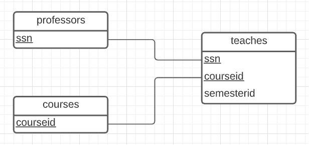
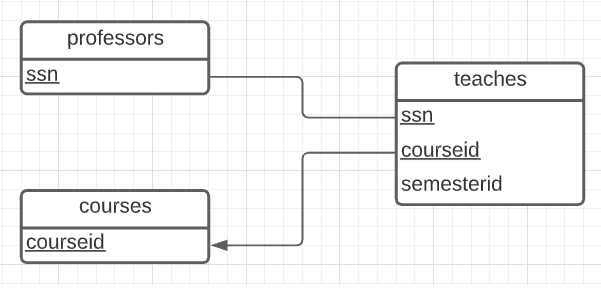
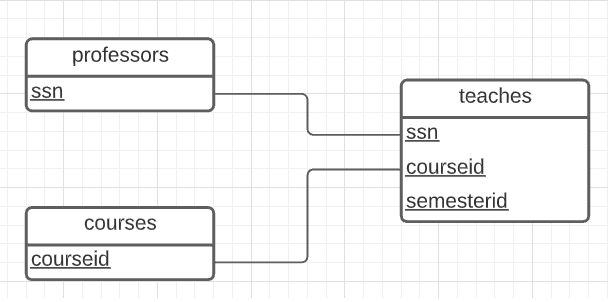
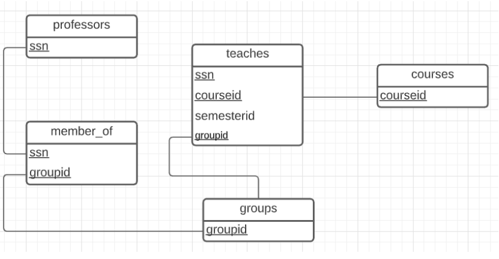

# csi2532_playground
Helin Evliyaoglu
Q1.



```sql
CREATE TABLE professors(
  ssn VARCHAR(50),
  PRIMARY KEY(ssn)
);

CREATE TABLE courses(
  courseid VARCHAR(50),
  PRIMARY KEY(courseid)
);

CREATE TABLE teaches(
  ssn VARCHAR(50),
  courseid VARCHAR(50),
  semesterid VARCHAR(10),
  PRIMARY KEY(ssn, courseid)
);
```

Q3.



```sql
CREATE TABLE professors(
  ssn VARCHAR(50),
  PRIMARY KEY(ssn)
);

CREATE TABLE courses(
  courseid VARCHAR(50),
  PRIMARY KEY(courseid)
);

CREATE TABLE teaches(
  ssn VARCHAR(50),
  courseid VARCHAR(50),
  semesterid VARCHAR(10),
  PRIMARY KEY(ssn, courseid)
);
```

Q5.



```sql
CREATE TABLE professors(
  ssn VARCHAR(50),
  PRIMARY KEY(ssn)
);

CREATE TABLE courses(
  courseid VARCHAR(50),
  PRIMARY KEY(courseid)
);

CREATE TABLE teaches(
  ssn VARCHAR(50),
  courseid VARCHAR(50),
  semesterid VARCHAR(10),
  PRIMARY KEY(ssn, courseid, semesterid)
);
```

Q6.



```sql
CREATE TABLE professors(
  ssn VARCHAR(50),
  PRIMARY KEY(ssn)
);

CREATE TABLE courses(
  courseid VARCHAR(50),
  PRIMARY KEY(courseid)
);

CREATE TABLE teaches(
  ssn VARCHAR(50),
  courseid VARCHAR(50),
  semesterid VARCHAR(10),
  groupid VARCHAR(10),
  PRIMARY KEY(ssn, courseid, groupid)
);

CREATE TABLE groups(
  groupid VARCHAR(10),
  PRIMARY KEY(groupid)
);

CREATE TABLE member_of(
  ssn VARCHAR(50),
  groupid VARCHAR(10),
  PRIMARY KEY(ssn, groupid)
);
```
